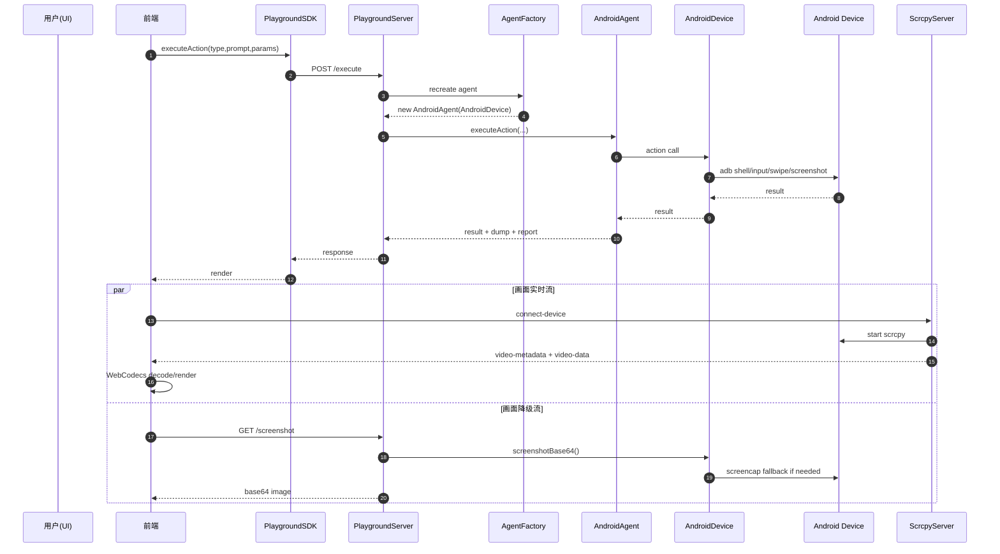

# Android Playground 实现分析（Midscene）

## 1. 目标与整体设计

`android-playground` 的核心目标是：

- 左侧提供 AI 指令执行能力（Playground）。
- 右侧提供 Android 设备实时画面预览（scrcpy）。
- 两条链路共享同一个设备选择与执行上下文。

整体上是 **双服务架构**：

1. `PlaygroundServer`（默认 `5800`）负责动作执行、配置、报告、截图 API。
2. `ScrcpyServer`（默认 `5700`）负责设备列表、视频流转发（Socket.IO）。

默认端口定义见：`packages/shared/src/constants/index.ts`。

---

## 2. 启动入口与服务编排

入口文件：`packages/android-playground/src/bin.ts`

启动流程：

1. 扫描 ADB 设备并让用户选择设备（多设备时交互选择）。
2. 用选中的 `deviceId` 创建 `PlaygroundServer` 的 `agentFactory`：
   - 每次执行创建新的 `AndroidDevice` + `AndroidAgent`。
3. 创建 `ScrcpyServer`，并写入 `currentDeviceId`。
4. 分别寻找可用端口（端口占用则自动递增）。
5. 并行启动两个服务。
6. 把 scrcpy 端口注入到全局变量，供前端读取。
7. 自动打开浏览器页面。

这意味着：**执行链路** 和 **画面链路** 是解耦的，但通过设备 ID 保持一致。

---

## 3. 前端结构

前端目录：`apps/android-playground/src`

主要组件：

- `App.tsx`
  - 两栏布局（左 AI Playground，右设备画面）。
  - 读取 `window.SCRCPY_PORT`，建立到 scrcpy 服务的 Socket 连接。
  - 获取 `devices-list` 后自动连接选中设备。
  - 对远程设备（`IP:PORT`）切换到轮询截图模式。

- `components/playground-panel/index.tsx`
  - 创建 `PlaygroundSDK({ type: 'remote-execution' })`。
  - 使用 `UniversalPlayground` 渲染输入、动作和结果。
  - 支持 `overrideConfig` 动态更新 AI 配置。

- `components/scrcpy-player/index.tsx`
  - Socket.IO 接收 `video-metadata` 与 `video-data`。
  - 使用 `@yume-chan/scrcpy-decoder-webcodecs` 解码并渲染 Canvas。
  - 支持自动重连、元数据超时重试、截图下载、断开连接。

---

## 4. 指令执行链路（PlaygroundServer）

核心文件：`packages/playground/src/server.ts`

关键接口：

- `GET /status`：服务健康检查并返回 `id`。
- `POST /action-space`：返回当前设备支持动作（含参数 schema）。
- `POST /execute`：执行动作主入口。
- `POST /cancel/:requestId`：取消当前任务。
- `GET /screenshot`：截图（base64）。
- `GET /interface-info`：设备接口类型和描述。
- `POST /config`：覆盖 AI 配置。

`/execute` 核心逻辑：

1. 每次执行前重建 agent（保证最新配置生效）。
2. 若传入 `deviceOptions`，覆盖到当前 interface options。
3. 防并发执行（同一时刻一个任务）。
4. 调用 `executeAction(...)` 执行动作。
5. 返回 `result + dump + reportHTML`，并清理任务锁。

---

## 5. 画面链路（ScrcpyServer + 前端解码）

服务端：`packages/android-playground/src/scrcpy-server.ts`

职责：

1. 与本地 ADB Server（127.0.0.1:5037）通信获取设备列表。
2. 处理 Socket 事件：
   - `get-devices`
   - `switch-device`
   - `connect-device`
3. 启动 scrcpy：
   - push `scrcpy-server` 二进制到设备。
   - 启动后读取视频流。
4. 推送事件：
   - `video-metadata`
   - `video-data`
5. 每 3 秒轮询设备变化，广播 `devices-list`。

前端：`apps/android-playground/src/components/scrcpy-player/index.tsx`

职责：

1. 收到 metadata 后创建 decoder。
2. 对 `configuration/data` 帧做顺序处理。
3. 把流 pipe 到 decoder 的 writable。
4. 断线自动重连，避免界面卡死。

---

## 6. Android 设备执行抽象（AndroidAgent / AndroidDevice）

- `packages/android/src/agent.ts`
  - `AndroidAgent` 封装平台动作：`launch`、`runAdbShell`、`back/home/recentApps`。

- `packages/android/src/device.ts`
  - 负责 ADB 生命周期、屏幕尺寸与坐标换算、输入、滚动、截图等。
  - 截图策略：
    1. 优先 scrcpy adapter 截图。
    2. 失败回退 `adb.takeScreenshot`。
    3. 再失败回退 `screencap + pull`。
  - 对输入法与特殊字符有防护逻辑（例如 yadb fallback）。

平台动作定义集中在 `createPlatformActions(...)`，是 action-space 的来源之一。

---

## 7. 一次执行的关键时序图

---

## 8. 学习源码推荐顺序

1. `packages/android-playground/src/bin.ts`（启动、依赖关系、端口注入）
2. `packages/playground/src/server.ts`（执行主链路）
3. `packages/android-playground/src/scrcpy-server.ts`（视频链路）
4. `apps/android-playground/src/App.tsx` + `components/scrcpy-player/index.tsx`（前端连接与解码）
5. `packages/android/src/agent.ts` + `packages/android/src/device.ts`（底层设备能力）

---

## 9. 调试建议（实战）

- 先确认设备可见：`adb devices`。
- 启动后先看两个端口日志（`5800` 与 `5700`）。
- 若无画面但可执行动作，优先排查 scrcpy 通道。
- 若有画面但动作失败，优先排查 `/execute` 与 ADB 命令错误。
- 利用 `/status`、`/action-space`、`/screenshot` 做分层诊断。

