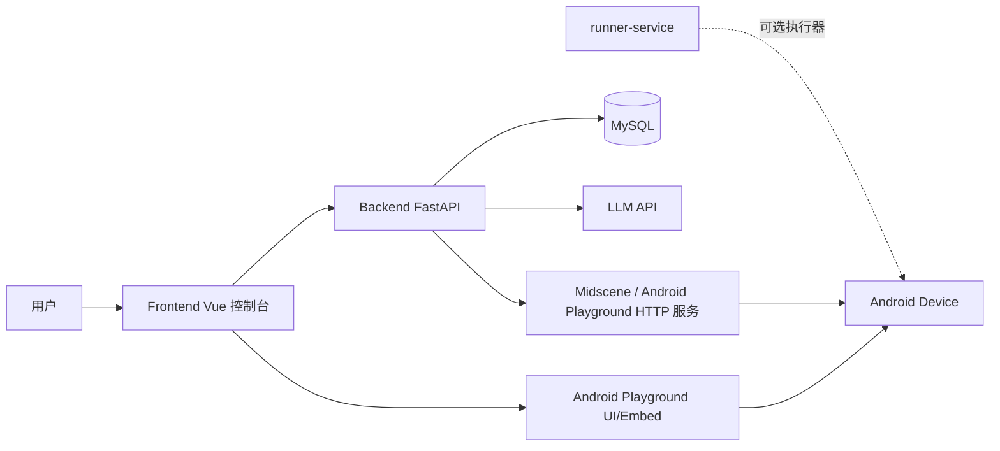
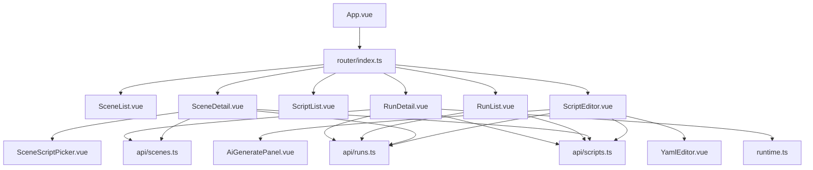
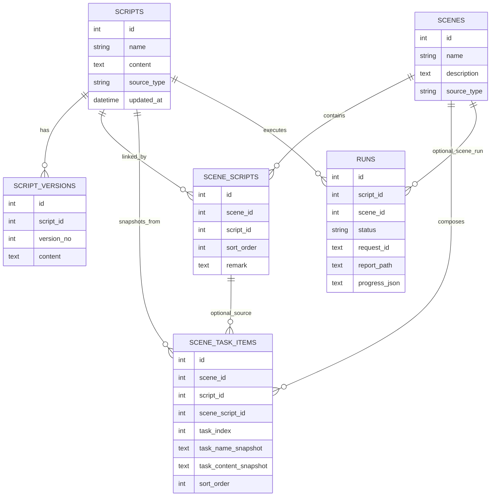
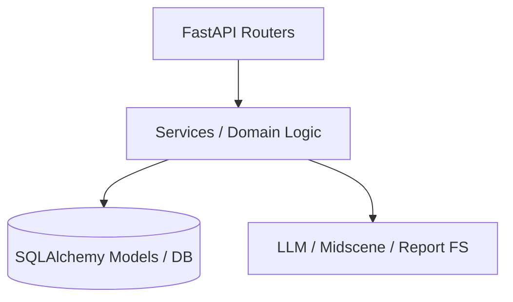
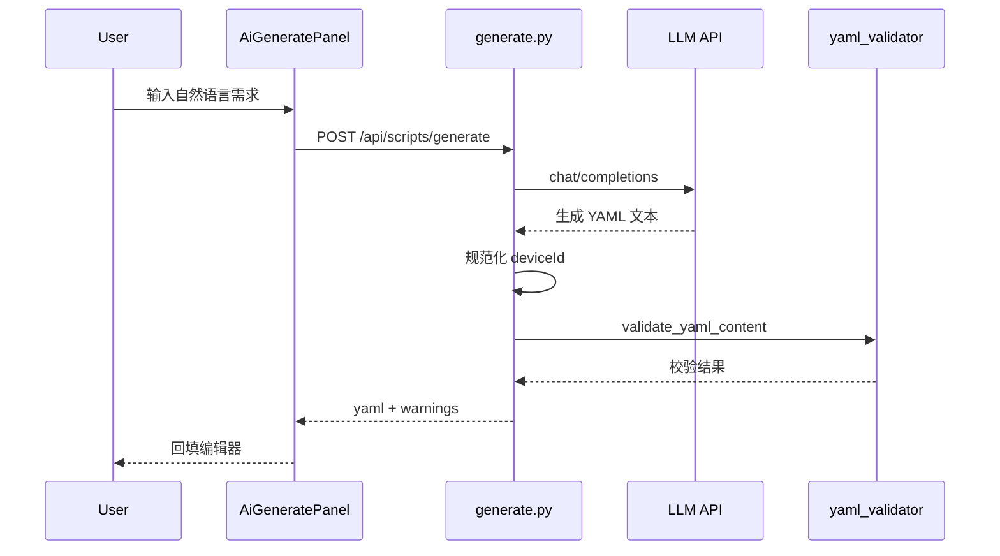
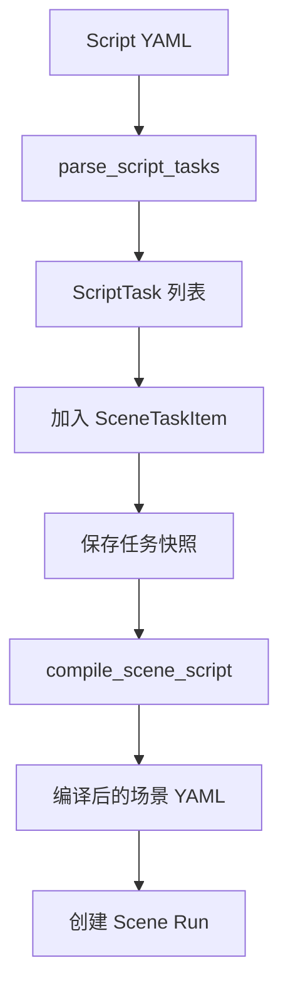
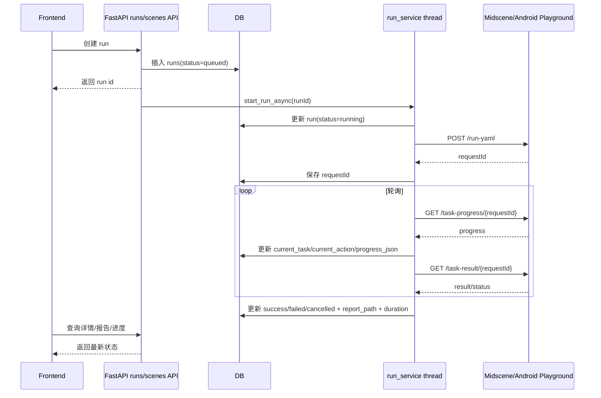
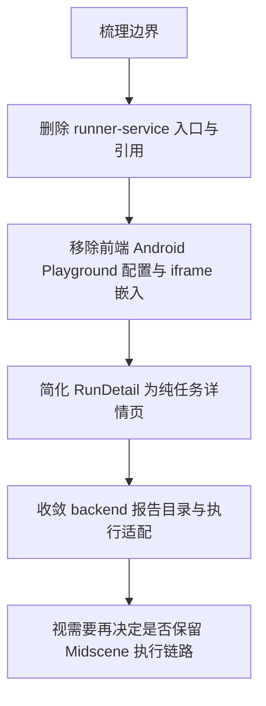

# UIX 项目架构分析

## 1. 文档目标

本文基于当前仓库代码实现，对项目的系统边界、模块职责、数据模型、运行链路、外部依赖与后续重构方向做详细梳理。

当前仓库路径：`/Users/yaohongliang/work/liuyao/AI/UI/UIX`

本文重点面向两个目标：

1. 帮助快速建立对当前系统的整体认知。
2. 为后续“仅保留前端 + 后端能力”的重构提供边界依据。

---

## 2. 系统总体判断

当前仓库不是单一的前后端应用，而是一个 **主业务平台 + 多个执行/设备接入外围系统** 的组合。

### 2.1 主业务核心

主业务核心由两部分组成：

- `frontend/`：Vue 3 控制台，用于管理脚本、场景、运行记录。
- `backend/`：FastAPI API 服务，负责数据持久化、脚本生成、场景编排、运行调度与报告读取。

### 2.2 外围执行系统

除前后端外，还存在两个外围执行能力：

- `runner-service/`：Node/Fastify 执行器，基于 `@midscene/android` 真正执行 YAML。
- `android-playground/`：独立 Android Playground 工作区，既承担设备连接与执行能力，也提供设备画面/报告等展示能力。

### 2.3 当前真实架构特征

虽然仓库内同时存在 `runner-service` 与 `android-playground`，但从当前后端实现看，**后端运行链路主要直接依赖 Midscene/Android Playground HTTP 服务**，而不是依赖 `runner-service`。

关键证据：

- `backend/app/services/run_service.py:413` 通过 `_midscene_run_yaml()` 直接调用 Midscene `/run-yaml`
- `backend/app/services/run_service.py:417` 通过 `_midscene_task_progress()` 直接调用 Midscene `/task-progress/{requestId}`
- `backend/app/services/run_service.py:428` 通过 `_midscene_task_result()` 直接调用 Midscene `/task-result/{requestId}`
- `backend/app/services/run_service.py:432` 通过 `_midscene_cancel_task()` 直接调用 Midscene `/cancel/{requestId}`

这意味着：

- `runner-service` 是一条可选执行路径，当前并未接入后端主链路。
- `android-playground` / Midscene 服务是当前主执行依赖。

---

## 3. 顶层目录职责

| 目录 / 文件 | 作用 |
|---|---|
| `frontend/` | 前端控制台，负责页面、表单、运行详情展示 |
| `backend/` | 后端 API、数据库模型、业务服务、运行调度 |
| `runner-service/` | 独立 Node 执行器服务，维护内存态 run 生命周期 |
| `android-playground/` | 独立 pnpm workspace，提供 Android 设备自动化与 UI 能力 |
| `scripts/` | 本地开发启动脚本 |
| `docker-compose.yml` | 前后端及 runner 的容器编排 |
| `docker/` | 容器化运行说明与环境示例 |
| `md/` | 文档输出目录 |

---

## 4. 技术栈

## 4.1 前端

关键文件：

- `frontend/package.json`
- `frontend/src/main.ts:1`
- `frontend/src/router/index.ts:10`
- `frontend/src/config/runtime.ts:13`

技术栈：

- Vue 3
- TypeScript
- Vite
- Pinia
- Vue Router
- Element Plus
- Axios
- Monaco Editor

前端定位：

- 不是低层设备执行端，而是面向业务用户/开发者的“自动化任务控制台”。
- 聚焦脚本资产管理、场景编排与运行结果查看。

## 4.2 后端

关键文件：

- `backend/pyproject.toml`
- `backend/app/main.py:17`
- `backend/app/core/config.py:8`
- `backend/app/core/database.py:24`

技术栈：

- Python 3.11+
- FastAPI
- SQLAlchemy 2
- Pydantic / pydantic-settings
- PyYAML
- HTTPX
- Alembic（依赖存在，但当前启动逻辑仍以 `create_all` 为主）

后端定位：

- 既承担标准 CRUD API，又承担运行编排与外部执行系统集成。
- 不是纯 REST CRUD 服务，而是一个轻量 orchestration backend。

## 4.3 Runner Service

关键文件：

- `runner-service/package.json`
- `runner-service/src/server.ts:49`
- `runner-service/src/services/run-manager.ts:44`
- `runner-service/src/services/yaml-runner.ts:110`

技术栈：

- Node.js
- TypeScript
- Fastify
- `@midscene/android`
- `@midscene/core`

定位：

- 独立执行器 HTTP 服务。
- 管理 run 的内存态生命周期，不做持久化。

## 4.4 Android Playground

从目录和脚本可判断，它是一个独立 pnpm workspace，不是当前主业务前端的一部分。

关键线索：

- `android-playground/pnpm-workspace.yaml`
- `scripts/start-android.sh:82`
- `docker-compose.yml:41`
- `frontend/src/config/runtime.ts:20`
- `frontend/src/pages/RunDetail.vue:299`

定位：

- 提供 Android 设备接入与实时画面。
- 提供 Midscene HTTP 接口能力。
- 同时为前端运行详情页提供嵌入式设备画面入口。

---

## 5. 系统上下文图

### 解读

- 用户主要通过前端操作系统。
- 前端主要依赖后端 API。
- 前端在运行详情页还会直接嵌入 Android Playground 页面。
- 后端持久化到数据库，并调用 LLM 与 Midscene 服务。
- `runner-service` 与当前主链路是并列的可选执行器，而不是必须组件。

---

## 6. 前端架构分析

## 6.1 前端入口与布局

关键文件：

- `frontend/src/main.ts:10`
- `frontend/src/App.vue:2`
- `frontend/src/router/index.ts:10`

### 应用启动

`frontend/src/main.ts:10` 完成：

- 创建 Vue App
- 挂载 Pinia
- 挂载 Router
- 挂载 Element Plus

### 顶层布局

`frontend/src/App.vue:2` 是整个控制台框架，顶部是三个一级导航：

- 场景列表
- 脚本列表
- 运行列表

说明当前产品信息架构就是围绕这三个核心实体组织的。

### 路由结构

`frontend/src/router/index.ts:12` 定义了 6 个主路由：

- `/scenes`：场景列表
- `/scenes/:id`：场景详情
- `/scripts`：脚本列表
- `/scripts/:id`：脚本编辑
- `/runs`：运行列表
- `/run/:id`：运行详情

这也对应了前端的 3 个主业务域：

1. 脚本管理
2. 场景编排
3. 运行追踪

---

## 6.2 运行时配置

关键文件：

- `frontend/src/config/runtime.ts:6`
- `frontend/src/api/client.ts:4`
- `docker-compose.yml:39`

前端运行时配置支持两类地址：

- `API_BASE_URL`
- `ANDROID_PLAYGROUND_URL`

### 配置来源顺序

`frontend/src/config/runtime.ts:13` 和 `frontend/src/config/runtime.ts:20` 表明配置优先级如下：

1. 浏览器全局注入的 `window.__APP_CONFIG__`
2. `import.meta.env.VITE_*`
3. 默认值

默认值：

- API：`http://127.0.0.1:8000`
- Android Playground：`http://localhost:5800`

### 架构含义

这说明前端天然被设计为同时连接两个后端目标：

1. 主后端 API
2. Android Playground UI / 设备画面

因此，如果后续只保留前后端能力，前端需要重点清理：

- `ANDROID_PLAYGROUND_URL`
- 运行详情页中的 iframe 设备画面能力

---

## 6.3 API 封装层

关键文件：

- `frontend/src/api/client.ts:4`
- `frontend/src/api/scripts.ts:35`
- `frontend/src/api/scenes.ts:70`
- `frontend/src/api/runs.ts:48`

前端 API 封装非常清晰，按资源拆分：

- `scriptApi`
- `sceneApi`
- `runApi`

### 特征

- 没有复杂 repository 或 service 抽象，直接对 REST API 做薄封装。
- 模型类型与 API 方法集中在一起，便于页面直接消费。
- 复杂业务状态主要靠页面内部 state 维护，而不是集中 store。

### 例外：Pinia 使用很轻

仅看到一个 store：

- `frontend/src/stores/script.ts:5`

目前只用于脚本列表缓存，说明前端整体仍偏页面驱动而不是全局状态驱动。

---

## 6.4 页面职责拆分

### 6.4.1 ScriptList

关键文件：`frontend/src/pages/ScriptList.vue:1`

职责：

- 展示脚本列表
- 新建脚本
- 复制脚本
- 删除脚本
- 跳转编辑页

特征：

- 默认模板内置在页面中（`frontend/src/pages/ScriptList.vue:52`）
- 说明脚本本体被视为系统的一等资产

### 6.4.2 ScriptEditor

关键文件：`frontend/src/pages/ScriptEditor.vue:1`

职责：

- 编辑脚本名称 / 来源 / 内容
- 校验 YAML
- AI 生成 YAML
- 发起脚本执行
- 查看被哪些场景引用

它是脚本域最核心的页面。

其中几个重要动作：

- `save()`：保存脚本
- `validate()`：调用后端 YAML 校验
- `execute()`：调用 `runApi.create()` 创建 run
- `onYamlGenerated()`：将 AI 生成结果回填编辑器

### 6.4.3 SceneList

关键文件：`frontend/src/pages/SceneList.vue:1`

职责：

- 场景 CRUD
- 跳转场景编辑页
- 复制场景

### 6.4.4 SceneDetail

关键文件：`frontend/src/pages/SceneDetail.vue:1`

这是整个项目最复杂的前端页面，也是场景编排核心。

职责包括：

1. 维护场景元信息（名称、说明、来源）
2. 维护脚本关联顺序
3. 从脚本解析任务并加入场景任务编排
4. 维护任务快照
5. 支持任务同步、拖拽排序、备注
6. 预览“编译后的场景 YAML”
7. 执行整个场景

### 关键架构特点：场景不是简单“引用脚本列表”

场景内部有两层结构：

1. `SceneScriptRelation`：脚本级关联
2. `SceneTaskItem`：任务级编排快照

这意味着场景系统本质上做的是：

> 先挂脚本，再从脚本中抽取 task，最后形成跨脚本的任务编排序列。

这也是后端 `scene_task_items` 表存在的根本原因。

### 6.4.5 RunList

关键文件：`frontend/src/pages/RunList.vue:1`

职责：

- 展示运行记录列表
- 按状态过滤
- 展示脚本名、状态、耗时、错误信息

### 6.4.6 RunDetail

关键文件：`frontend/src/pages/RunDetail.vue:1`

这是运行观测中心，职责最多：

1. 展示 run 基本信息
2. 轮询运行详情与报告
3. 展示实时任务日志
4. 嵌入 Android Playground 设备画面 iframe
5. 展示同脚本/同场景历史记录
6. 查看执行时脚本快照
7. 取消执行 / 重新执行
8. 下载或预览报告

该页面体现了当前系统与 Android Playground 的强耦合。

关键点：

- `frontend/src/pages/RunDetail.vue:316` 生成 Android Playground embed URL
- `frontend/src/pages/RunDetail.vue:113` 用 iframe 嵌入设备画面
- `frontend/src/pages/RunDetail.vue:479` 轮询 `runApi.detail()` 与 `runApi.report()`
- `frontend/src/pages/RunDetail.vue:439` 额外刷新 task logs

如果后续做“仅保留前后端能力”重构，这个页面会是清理成本最高的前端页面。

---

## 6.5 前端模块关系图

---

## 7. 后端架构分析

## 7.1 应用入口

关键文件：`backend/app/main.py:17`

后端应用由 FastAPI 启动，并注册了四类路由：

- `scripts_router`
- `scenes_router`
- `generate_router`
- `runs_router`

### 启动行为

`backend/app/main.py:59` 的启动逻辑包含两个关键动作：

1. `Base.metadata.create_all(bind=engine)`
2. `_ensure_runs_columns()` 自动补齐 `runs` 表缺失字段

### 架构解读

这说明当前后端启动策略偏“自修复式 schema 管理”：

- 不完全依赖 Alembic migration
- 倾向于通过启动时自动建表和补列来兼容历史数据

优点：

- 本地启动简单
- 容错高

缺点：

- schema 演进不够显式
- 生产可控性较弱

---

## 7.2 配置与数据库

关键文件：

- `backend/app/core/config.py:8`
- `backend/app/core/database.py:8`

### 配置项分类

后端配置主要分成四组：

#### 1. 应用配置

- `app_name`
- `app_env`

#### 2. 数据库配置

- `database_url`
- `db_pool_size`
- `db_max_overflow`
- `db_pool_timeout_sec`

#### 3. 运行执行配置

- `run_scripts_dir`
- `midscene_base_url`
- `midscene_timeout_sec`
- `midscene_status_poll_interval_ms`
- `report_root_dir`

#### 4. LLM 配置

- `llm_base_url`
- `llm_api_key`
- `llm_model_name`
- `llm_timeout_sec`
- `llm_generation_system_prompt`
- `llm_generation_system_prompt_file`
- `midscene_model_*` fallback

### 数据库接入

`backend/app/core/database.py:24` 创建 SQLAlchemy engine。

特征：

- MySQL 连接池参数
- MySQL 场景有连接池参数
- 通过 `get_db()` 提供 request-scoped Session

---

## 7.3 领域模型

## 7.3.1 Script

文件：`backend/app/models/script.py:9`

字段：

- `id`
- `name`
- `content`
- `source_type`
- `created_at`
- `updated_at`

定位：

- 自动化 YAML 脚本资产

## 7.3.2 ScriptVersion

文件：`backend/app/models/script_version.py:9`

字段：

- `script_id`
- `version_no`
- `content`
- `created_at`

定位：

- 脚本版本快照
- 每次更新脚本时追加版本，而不是覆盖历史

## 7.3.3 Scene

文件：`backend/app/models/scene.py:9`

字段：

- `id`
- `name`
- `description`
- `source_type`
- `created_at`
- `updated_at`

定位：

- 脚本编排容器

## 7.3.4 SceneScript

文件：`backend/app/models/scene_script.py:9`

字段：

- `scene_id`
- `script_id`
- `sort_order`
- `remark`

定位：

- 场景与脚本的关联关系
- 保留顺序和备注

## 7.3.5 SceneTaskItem

文件：`backend/app/models/scene_task_item.py:9`

字段：

- `scene_id`
- `script_id`
- `scene_script_id`
- `task_index`
- `task_name_snapshot`
- `task_content_snapshot`
- `sort_order`
- `remark`

定位：

- 场景编排最关键的数据结构
- 保存“脚本某个任务在加入场景当时的快照”

这解决了一个核心问题：

> 脚本后续发生变更时，场景可以识别任务是否 stale，并决定是否同步。

## 7.3.6 Run

文件：`backend/app/models/run.py:9`

字段非常多，说明 `Run` 不只是简单状态表，而是运行审计与展示聚合体。

关键字段：

- 关联字段：`script_id`、`scene_id`
- 生命周期：`status`、`started_at`、`ended_at`、`duration_ms`
- 结果：`report_path`、`summary_path`、`error_message`
- 外部关联：`request_id`
- 实时进度：`current_task`、`current_action`、`progress_json`
- 执行快照：`scene_name_snapshot`、`script_name_snapshot`、`script_content_snapshot`、`script_updated_at_snapshot`
- 用户增强字段：`remark`、`is_starred`

### 架构解读

`Run` 同时承担：

1. 执行队列项
2. 运行状态表
3. 结果元数据表
4. UI 展示快照表

这种聚合设计让前端读取非常方便，但也让 `Run` 模型承担了较多职责。

---

## 7.4 数据模型关系图

---

## 8. 后端 API 分层

后端分层大致如下：

### 具体到模块

- `api/scripts.py`：脚本 CRUD、复制、校验、列出任务
- `api/generate.py`：AI 生成 YAML
- `api/scenes.py`：场景 CRUD、脚本关联、任务编排、场景运行
- `api/runs.py`：run CRUD-ish、进度、取消、报告、备注、星标
- `services/scene_compiler.py`：脚本解析、任务抽取、场景 YAML 编译
- `services/yaml_validator.py`：YAML 校验
- `services/llm_service.py`：调用 LLM 生成 YAML
- `services/run_service.py`：执行调度与 Midscene 对接

---

## 9. 核心业务链路

## 9.1 脚本管理链路

### 能力

- 脚本列表 / 详情 / 创建 / 更新 / 删除 / 复制
- 脚本版本快照
- YAML 校验
- 从 YAML 中解析任务列表

### 关键实现

- `backend/app/api/scripts.py:34` 列表
- `backend/app/api/scripts.py:59` 详情
- `backend/app/api/scripts.py:99` 创建
- `backend/app/api/scripts.py:124` 更新
- `backend/app/api/scripts.py:173` 复制
- `backend/app/api/scripts.py:204` 校验
- `backend/app/api/scripts.py:79` 列出任务

### 架构特征

脚本不是只存文本，而是：

- 有版本历史
- 可被场景引用
- 可被解析成任务粒度

因此在领域模型上，Script 更像“自动化资产源文件”。

---

## 9.2 AI 生成 YAML 链路

### 前端入口

- `frontend/src/components/AiGeneratePanel.vue:69`
- `frontend/src/api/scripts.ts:63`

### 后端入口

- `backend/app/api/generate.py:46`

### 核心服务

- `backend/app/services/llm_service.py:74`

### 处理流程

### 架构特征

这条链路的设计比较稳健：

1. 先调用 LLM
2. 再做结构归一化
3. 再做 YAML 校验
4. 不合法则 422 返回结构化错误

关键实现点：

- `backend/app/api/generate.py:17` 对模型产物做 placeholder deviceId 清理
- `backend/app/services/llm_service.py:50` 构造 system/user prompt
- `backend/app/services/llm_service.py:67` 兼容 fenced yaml 输出
- `backend/app/services/yaml_validator.py:12` 校验 `android` 与 `tasks`

---

## 9.3 场景编排链路

这是项目最有业务特征的一段。

### 本质流程

1. 场景关联多个脚本
2. 从每个脚本解析出 task 列表
3. 用户按 task 粒度组装场景任务流
4. 系统将 task 快照固化到 `scene_task_items`
5. 编译时按快照重新生成完整 YAML

### 关键实现

- `backend/app/services/scene_compiler.py:12` 解析脚本任务
- `backend/app/services/scene_compiler.py:64` 提取脚本 env 区段
- `backend/app/services/scene_compiler.py:81` 编译场景 YAML
- `backend/app/api/scenes.py:390` 添加任务项
- `backend/app/api/scenes.py:528` 获取编译后场景脚本

### 场景编排流程图

### 为什么要保存任务快照

这是当前场景设计最重要的架构点。

如果场景只保存 `script_id + task_index`，会有两个问题：

1. 脚本更新后任务内容可能变化，历史场景行为失真。
2. task 顺序或名字变化后，无法准确判断场景是否需要同步。

因此系统选择保存：

- `task_name_snapshot`
- `task_content_snapshot`

并通过 `scene_task_sync_status()` 判断：

- `current`
- `stale`
- `missing`

对应实现：

- `backend/app/services/scene_compiler.py:96`

这是该项目最值得保留的业务建模能力之一。

---

## 9.4 运行执行链路

### 单脚本执行

前端：

- `frontend/src/pages/ScriptEditor.vue:116`

后端：

- `backend/app/api/runs.py:73`
- `backend/app/services/run_service.py:27`
- `backend/app/services/run_service.py:122`

### 场景执行

前端：

- `frontend/src/pages/SceneDetail.vue` 中 `runScene()`（页面后半段）

后端：

- `backend/app/api/scenes.py:534`
- `backend/app/services/run_service.py:45`

### 后端执行本质

后端不是把 YAML 推给 `runner-service`，而是：

1. 在数据库中创建 `Run`
2. 开一个后台线程 `start_run_async()`
3. 线程里直接调用 Midscene HTTP 服务
4. 轮询进度与结果
5. 持续把进度和结果写回 `runs` 表

### 执行时序图

### 架构特征

1. **执行与 API 进程耦合**
   - run 在线程中执行
   - 适合轻量部署
   - 不适合大量并发或多实例一致性

2. **数据库承担状态总线角色**
   - 前端读 DB 聚合态
   - 线程写 DB

3. **Midscene 是真正执行核心**
   - 后端是 orchestration，不是 executor

---

## 9.5 报告与实时进度链路

### 报告获取

关键实现：

- `backend/app/api/runs.py:157`
- `backend/app/api/runs.py:179`
- `backend/app/services/run_service.py:316`
- `backend/app/services/run_service.py:396`

逻辑：

1. 优先找 `report_path`
2. 否则尝试从 Midscene runtime result 中取报告
3. 再否则尝试直接取内嵌 HTML

### 报告目录白名单

`backend/app/api/runs.py:37` 明确允许以下根目录：

- `settings.report_root_dir`
- 仓库根目录 `midscene_run/report`
- `runner-service/midscene_run/report`
- `android-playground/packages/android-playground/midscene_run/report`

这再次说明后端当前对 runner 和 android-playground 都有兼容，但主设计仍围绕 Midscene 产物目录。

### 实时进度

后端对 progress 做了两层瘦身：

- `backend/app/services/run_service.py:749` `_compact_midscene_progress`
- `backend/app/api/runs.py:226` `_compact_progress_json`

目的：

- 避免把大块 `uiContext`、截图、base64 数据塞给前端
- 保证运行详情页轮询可控

这是一个不错的性能设计点。

---

## 10. runner-service 架构定位

## 10.1 服务职责

关键文件：

- `runner-service/src/server.ts:49`
- `runner-service/src/services/run-manager.ts:44`
- `runner-service/src/services/yaml-runner.ts:110`

Runner 暴露接口：

- `/health`
- `/runs/start`
- `/runs/:runId/progress`
- `/runs/:runId/cancel`
- `/runs/:runId/result`

### 内部结构

- `RunManager`：管理内存态 run 状态机
- `YamlRunner`：真正调用 `@midscene/android` 执行 YAML

### 重要特征

`runner-service/src/services/run-manager.ts:13` 的注释已经写得很清楚：

> 不做持久化，持久化由 ui_demo backend 负责

也就是说它设计上是：

- 执行器进程
- 非持久化状态服务
- 需要上层系统负责数据库与展示

## 10.2 为什么说它当前不是主链路

尽管 runner 功能完整，但当前后端没有调用它的接口。

仓库证据：

- 后端 `run_service.py` 中没有 runner URL 配置，也没有对 `/runs/start` 的 HTTP 调用。
- `docker-compose.yml:54` 中 runner 被挂在 `profiles: [runner]` 下，说明它是可选服务。
- `frontend/src/pages/RunDetail.vue` 也没有直接调用 runner。

因此可以判断：

> runner-service 更像一个备用/实验/迁移中的执行器，而不是当前系统闭环不可缺少的部分。

这也是后续“只保留前后端能力”重构时最容易下手裁剪的模块之一。

---

## 11. Android Playground 架构定位

虽然本次没有逐文件深读 `android-playground` workspace，但从主项目代码已经能看出它在系统中的三重角色：

1. **设备执行能力提供者**
2. **Midscene HTTP 服务承载者**
3. **前端设备实时画面嵌入来源**

关键证据：

- `backend/app/core/config.py:14` 默认 `midscene_base_url = http://localhost:5800`
- `frontend/src/config/runtime.ts:20` 默认 `ANDROID_PLAYGROUND_URL = http://localhost:5800`
- `frontend/src/pages/RunDetail.vue:316` 直接构造 embed URL
- `scripts/start-android.sh:84` 明确作为独立服务启动

### 架构含义

Android Playground 当前既服务后端，也服务前端：

- 对后端：提供执行 API
- 对前端：提供设备画面 iframe / 报告上下文

因此它是当前系统真正的强外部依赖。

如果未来要“只保留前端 + 后端”，需要先决定：

- 是彻底移除设备执行能力？
- 还是将 Midscene 接口能力吸收到后端内部？
- 还是保留后端对 Midscene 的调用，但移除前端对 Android Playground UI 的直接耦合？

从改造成本看，第三种通常最平滑。

---

## 12. 部署与运行方式

## 12.1 Docker Compose

文件：`docker-compose.yml:1`

当前 Compose 编排了三个服务：

- `backend`
- `frontend`
- `runner`（可选 profile）

### 关键点

#### backend

- 暴露 8000
- 需要数据库地址
- 需要 Midscene 地址
- 共享 `midscene_report` 卷

#### frontend

- 暴露 5173 -> 容器 80
- 依赖 backend 健康检查
- 注入 `API_BASE_URL` 和 `ANDROID_PLAYGROUND_URL`

#### runner

- 可选 profile
- 暴露 8100
- 共享 `midscene_report` 卷

### 重要结论

Compose 并未把 `android-playground` 放进去，说明当前推荐模式是：

- 主业务服务可容器化
- Android Playground 更适合宿主机运行并直连设备

---

## 12.2 本地启动脚本

### frontend

文件：`scripts/start-frontend.sh:21`

- 进入 `frontend`
- 若无依赖则安装
- 用 pnpm 启 Vite

### backend

文件：`scripts/start-backend.sh:3`

- 进入 `backend`
- 若无虚拟环境则 `uv sync`
- 使用 `uvicorn --reload`
- 进程崩溃自动重启

### runner

文件：`scripts/start-runner.sh:6`

- 进入 `runner-service`
- 若无依赖则安装
- `npm run dev`

### android-playground

文件：`scripts/start-android.sh:3`

这是最复杂的启动脚本，负责：

- WSL/宿主机 IP 探测
- ANDROID_HOME / ADB 环境准备
- 启动 adb server
- 构建 workspace 各包
- 启动 Android Playground server

### 架构结论

`start-android.sh` 的复杂度本身就说明：

> Android Playground 是设备运行基础设施，不适合作为普通 Web 子服务简单嵌入到主业务中。

这也是后续重构时应优先做边界隔离的原因。

---

## 13. 当前系统的设计优点

## 13.1 业务对象建模清晰

系统围绕三个核心实体：

- Script
- Scene
- Run

这是清晰且容易理解的领域划分。

## 13.2 场景任务快照设计很好

`SceneTaskItem` 保留任务快照，并支持同步状态判定，是当前最有价值的业务设计之一。

## 13.3 前端页面职责直观

前端几乎是一页一职责，学习与维护成本较低。

## 13.4 后端对外部执行结果做了合理瘦身

对 progress、report 的处理能显著降低前端轮询压力。

## 13.5 运行快照设计有助于审计

`Run` 保存脚本快照、场景名快照、脚本更新时间快照，能够帮助追查历史执行上下文。

---

## 14. 当前系统的主要问题与耦合点

## 14.1 后端职责偏重

当前后端同时承担：

- 资源 CRUD
- 场景编排
- LLM 生成
- 异步执行调度
- Midscene HTTP 适配
- 报告文件网关

这会导致 `backend` 逐步变成“大一统服务”。

## 14.2 执行能力与业务系统强耦合

当前后端直接依赖 Midscene HTTP 服务，前端又直接依赖 Android Playground UI。

这造成：

- 前端与设备预览耦合
- 后端与执行基础设施耦合
- 本地开发依赖 Android 环境

## 14.3 runner-service 处于边缘化状态

它功能完整，但未进入主链路，造成维护成本和认知负担。

## 14.4 启动建表 + 自动补列不够正式

适合早期阶段，但不利于长期演进。

## 14.5 Run 模型职责聚合过多

短期使用方便，长期可能需要拆成：

- run 元信息
- run progress snapshot
- run artifacts / report metadata

不过这不一定是当前重构第一优先级。

---

## 15. 面向“只保留前端和后端能力”的重构边界建议

这是本文最关键的结论部分。

## 15.1 哪些是建议保留的核心能力

### 前端

建议保留：

- 场景列表 / 详情
- 脚本列表 / 编辑
- 运行列表 / 详情（基础版）
- YAML 编辑器
- AI 生成面板

### 后端

建议保留：

- Script / Scene / Run 数据模型
- ScriptVersion 版本能力
- YAML 校验
- 场景编排与快照机制
- 基础 run 记录能力
- LLM 生成链路

### 最应该保留的业务建模

1. `Script`
2. `Scene`
3. `SceneTaskItem`
4. `Run` 的快照思想

---

## 15.2 哪些能力属于可裁剪外围

### 1. `runner-service/`

理由：

- 当前不在主执行链路
- compose 中也是可选 profile
- 可单独删除而不影响主业务前后端 CRUD 与编排逻辑

### 2. 前端中对 Android Playground 的直接嵌入

重点位置：

- `frontend/src/config/runtime.ts:20`
- `frontend/src/pages/RunDetail.vue:74`
- `frontend/src/pages/RunDetail.vue:316`

理由：

- 这部分是 UI 对设备基础设施的直接耦合
- 不属于“前后端核心业务能力”

### 3. 后端中对特定报告目录的多实现兼容

重点位置：

- `backend/app/api/runs.py:37`

理由：

- 包含 runner-service 和 android-playground 的兼容路径
- 如果重构目标是收缩边界，这类兼容路径应统一简化

---

## 15.3 哪些部分虽然依赖外部系统，但不一定要立即删除

### 后端对 Midscene HTTP 的调用

重点位置：

- `backend/app/services/run_service.py:413`
- `backend/app/services/run_service.py:417`
- `backend/app/services/run_service.py:428`

这部分需要你先做产品决策：

#### 方案 A：完全砍掉执行能力

则需要：

- 前端去掉执行、取消、实时日志、报告预览
- 后端去掉 `run_service` 中对 Midscene 的调用
- Run 只保留“记录”意义，甚至可以一起简化

#### 方案 B：保留执行能力，但去掉 Android Playground UI 耦合

则需要：

- 前端移除 iframe 设备画面
- 后端继续调用 Midscene / 执行服务
- 保留 run / report / progress 基础能力

#### 方案 C：把执行器正式收敛为后端唯一外部适配

则需要：

- 统一后端只对接一个 executor 接口
- `runner-service` 或 Midscene 适配层二选一
- 这是架构更干净但改动更大的路线

### 结合你的目标的建议

如果你说的是：

> 当前项目只保留前端和后端的能力

那最自然的第一阶段是：

**先做方案 B**：

- 保留前后端主业务
- 去掉前端对 Android Playground UI 的直接依赖
- 清理 `runner-service`
- 后端暂时仍保留 Midscene 适配，作为执行实现细节

这样能最大程度降低重构风险。

---

## 16. 推荐的重构顺序

### 第 1 步：先删除明显外围

- `runner-service/`
- compose 中 runner profile
- `scripts/start-runner.sh`

### 第 2 步：切断前端对 Android Playground UI 的直接依赖

- 删除 `ANDROID_PLAYGROUND_URL`
- 清理 `RunDetail.vue` 中设备画面、历史抽屉里与设备联动的部分

### 第 3 步：保留 Run，但把其定位收敛到“任务记录”

- 继续保留 run 列表 / 详情
- 先保留状态、报告、错误、备注、星标
- 逐步评估实时日志与 iframe 是否还需要

### 第 4 步：最后再处理执行实现本身

- 如果以后还需要自动化执行，后端可保留一个更薄的 executor adapter
- 如果以后不再需要自动化执行，则再简化 `run_service`

---

## 17. 建议阅读顺序

如果后续要继续推进重构，建议按下面顺序读代码。

### 第一层：先建立系统认知

1. `docker-compose.yml`
2. `frontend/src/router/index.ts`
3. `backend/app/main.py`
4. `backend/app/core/config.py`

### 第二层：看三大核心域

1. `frontend/src/pages/ScriptEditor.vue`
2. `frontend/src/pages/SceneDetail.vue`
3. `frontend/src/pages/RunDetail.vue`
4. `backend/app/api/scripts.py`
5. `backend/app/api/scenes.py`
6. `backend/app/api/runs.py`

### 第三层：看真正业务机制

1. `backend/app/services/scene_compiler.py`
2. `backend/app/services/run_service.py`
3. `backend/app/services/llm_service.py`
4. `backend/app/services/yaml_validator.py`

### 第四层：最后看外围系统

1. `runner-service/src/server.ts`
2. `runner-service/src/services/run-manager.ts`
3. `runner-service/src/services/yaml-runner.ts`
4. `scripts/start-android.sh`

---

## 18. 总结

一句话概括当前项目：

> 这是一个以 Script / Scene / Run 为核心业务模型的自动化控制台系统，前后端是业务主干，Midscene / Android Playground 是当前执行基础设施，runner-service 是边缘化的可选执行器。

如果你的下一步目标是“只保留前端和后端能力”，从当前代码结构看，最稳妥的路线是：

1. 保留 `frontend + backend` 主业务结构
2. 保留 Script / Scene / Run 三个核心域
3. 保留场景任务快照与 YAML 生成能力
4. 移除 `runner-service`
5. 移除前端对 Android Playground UI 的直接依赖
6. 再决定后端是否继续保留 Midscene 执行适配

---

## 19. 附：本次分析引用的关键文件

### 前端

- `frontend/src/main.ts`
- `frontend/src/App.vue`
- `frontend/src/router/index.ts`
- `frontend/src/config/runtime.ts`
- `frontend/src/api/client.ts`
- `frontend/src/api/scripts.ts`
- `frontend/src/api/scenes.ts`
- `frontend/src/api/runs.ts`
- `frontend/src/pages/ScriptList.vue`
- `frontend/src/pages/ScriptEditor.vue`
- `frontend/src/pages/SceneList.vue`
- `frontend/src/pages/SceneDetail.vue`
- `frontend/src/pages/RunList.vue`
- `frontend/src/pages/RunDetail.vue`
- `frontend/src/components/AiGeneratePanel.vue`
- `frontend/src/components/YamlEditor.vue`
- `frontend/src/components/SceneScriptPicker.vue`

### 后端

- `backend/app/main.py`
- `backend/app/core/config.py`
- `backend/app/core/database.py`
- `backend/app/api/scripts.py`
- `backend/app/api/scenes.py`
- `backend/app/api/runs.py`
- `backend/app/api/generate.py`
- `backend/app/services/scene_compiler.py`
- `backend/app/services/run_service.py`
- `backend/app/services/llm_service.py`
- `backend/app/services/yaml_validator.py`
- `backend/app/models/script.py`
- `backend/app/models/script_version.py`
- `backend/app/models/scene.py`
- `backend/app/models/scene_script.py`
- `backend/app/models/scene_task_item.py`
- `backend/app/models/run.py`

### 外围系统

- `docker-compose.yml`
- `scripts/start-frontend.sh`
- `scripts/start-backend.sh`
- `scripts/start-runner.sh`
- `scripts/start-android.sh`
- `runner-service/src/server.ts`
- `runner-service/src/config.ts`
- `runner-service/src/services/run-manager.ts`
- `runner-service/src/services/yaml-runner.ts`
